# Tokibean 码豆 🫘

> 一只吃 token 的桌面小豆子 —— works with Claude Code。
> 本项目为社区作品,与 Anthropic 无关联、未获其背书;"Claude" 仅作兼容性事实描述。
> 默认角色「拱门·墩墩」为原创形象,项目所有内置皮肤均可自由分发。

住在桌面上的 Claude Code 状态监视宠物。不用喂食、不用养成——它只做三件事:

1. **知道 Claude 在不在干活**:通过 Claude Code hooks 实时接收事件,工作中会思考冒点点,完工时开心弹跳并发系统通知,等你输入/授权时会挥手提醒。
2. **实时 token 用量**:解析 `~/.claude/projects/` 下的本地 JSONL 记录。订阅用户(Pro/Max)看 5 小时窗口百分比和重置倒计时;API 用户看今日/近 7 天美元成本。
3. **额度状态可视化**:窗口用量超 80% 头顶冒感叹号,额度耗尽直接躺平睡觉(反正也干不了活)。

跨平台:Windows / macOS / Linux(Tauri 2)。

## 状态图鉴

每种状态一套专属动画,瞟一眼就知道 Claude 干到哪一步了:

| 思考中 | 跑命令 | 改代码 |
| :---: | :---: | :---: |
| 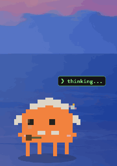 | 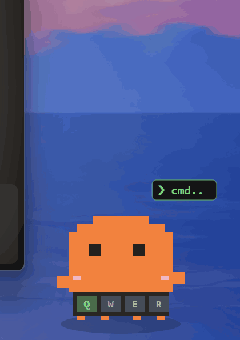 | 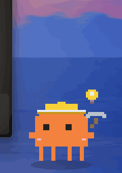 |
| 爱因斯坦发型+八字胡,叼烟斗背手踱步 | QWER 键帽随小手敲击随机亮起 | 想通了先亮灯泡,再戴工程帽抡镐 |

| 读文件 | 搜代码 | 查资料 |
| :---: | :---: | :---: |
| 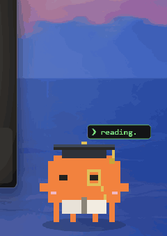 | 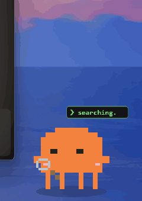 | 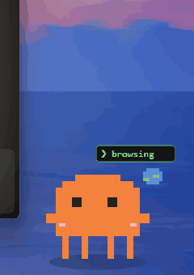 |
| 博士帽+单片眼镜,流苏轻摆慢翻书 | 举放大镜左右扫地 | 身旁小地球自转 |

| 派子任务 | 列计划 | 完工庆祝 |
| :---: | :---: | :---: |
| 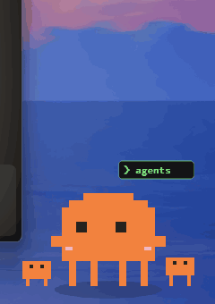 | 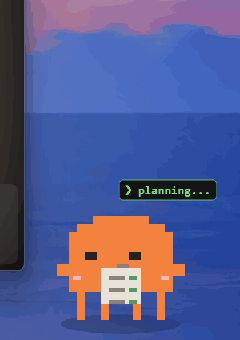 | 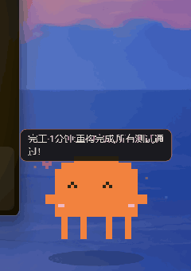 |
| 两侧冒出迷你分身同蹦 | 写字板任务逐条打勾 | 弹跳撒彩纸,气泡报耗时与摘要 |

| 等你输入 | 出错了 | 被拎起来 |
| :---: | :---: | :---: |
| 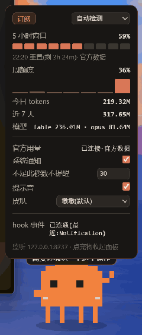 | 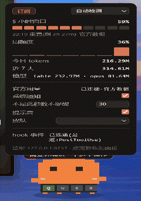 |  |
| 挥手蹦跳,久等升级喇叭/叹气 | 红色恼火纹+气得直晃 | 悬空蹬腿,松手落回 |

| 发呆摸鱼 | 后台任务在跑 | |
| :---: | :---: | :---: |
| 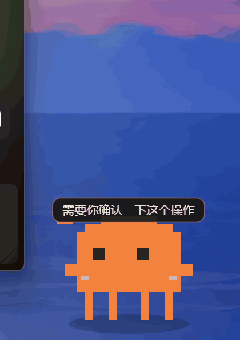 | 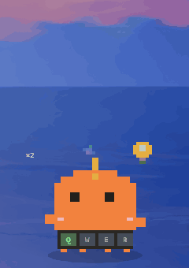 | |
| 溜达/打盹/伸懒腰/追蝴蝶 | 小卫星绕头顶巡航 | |

另有深夜矿灯、摸头冒心、额度耗尽躺平睡觉等隐藏戏份,装上自己发现。

## 运行要求

所有平台:
- [Rust](https://rustup.rs/)(1.77.2+,`rustup` 安装即可)
- Node.js 18+

各平台额外依赖:
- **Windows**:Microsoft C++ Build Tools(装 Rust 时会提示);WebView2 一般系统自带
- **macOS**:`xcode-select --install`
- **Linux (Debian/Ubuntu)**:
  ```bash
  sudo apt install libwebkit2gtk-4.1-dev build-essential curl wget file \
    libxdo-dev libssl-dev libayatana-appindicator3-dev librsvg2-dev
  ```

> **WSL 用户注意**:这是图形程序,要在 Windows 侧运行(Windows 上装 Rust + Node),不要在 WSL 里跑。Claude Code 跑在 WSL 里也能被感知:面板的「安装 hooks」会自动同步到每个 WSL 发行版的 `~/.claude/settings.json`(镜像网络模式直接用 `127.0.0.1`;NAT 模式自动改用 Windows 主机网关地址,但还需在宠物配置里把 `bind` 设为 `"0.0.0.0"` 并重启宠物)。

## 快速开始

```bash
cd claude-pet
npm install
npm run dev        # 开发模式启动
```

宠物出现在屏幕上之后:

1. **点宠物** → 展开用量面板
2. 点 **「安装 Claude Code hooks」** → 自动往 `~/.claude/settings.json` 写入 5 个事件转发(写入前会备份为 `settings.json.bak-claude-pet`)
3. **重启 Claude Code**(或在里面执行 `/hooks`)使配置生效
4. 在 Claude Code 里随便发条消息 → 宠物应该立刻进入"思考中"状态

顶部悬停会出现拖动手柄,按住可以把宠物拖到任意位置。系统托盘图标可以隐藏/退出。

打正式安装包:`npm run build`(macOS 打包前先跑一次 `npm run tauri icon app-icon.png` 生成 icns 图标)。

## 工作原理

```
Claude Code hooks ──HTTP POST──▶ 127.0.0.1:8737/event ──▶ 状态机 ──▶ 宠物动画 + 系统通知
~/.claude/projects/*.jsonl ──增量解析──▶ 5 小时窗口聚合 ──▶ 用量面板 + warn/limit 状态
```

- **事件映射**:`UserPromptSubmit`→工作中,`PreToolUse`→显示正在用的工具("跑命令"/"改代码"…),`Stop`→完工(气泡显示耗时和最后一条消息摘要,干满 1 分钟撒彩纸,10 分钟大庆祝),`Notification`→等你输入,`SessionStart/End`→会话边界
- **多会话**:按 `session_id` 独立记状态,多路并行时头顶显示 ×N 徽章;任一路在干活就算干活,全部完工才庆祝
- **通知降噪**:工作不足 30 秒的小活完工不发系统通知(配置里 `notify_min_secs` 可调)
- **hooks 用 curl 转发**而不是 http 类型 hook,为了兼容更多 Claude Code 版本;curl 在 Win10+/macOS/主流 Linux 都自带
- **5 小时窗口口径**:从窗口内首次活动所在的 UTC 整点开始,持续 5 小时(与 ccusage 的 blocks 口径一致)
- **订阅限额说明**:Anthropic 不公开具体限额,且会随服务器负载浮动。默认用你**历史最高窗口用量**当估算基准;想手动指定就改配置里的 `block_limit`
- **订阅/API 判定**:自动模式下,环境里有 `ANTHROPIC_API_KEY` 视为 API 计费,否则视为订阅。判不准就在面板里手动切

## 配置

配置文件:`~/.config/claude-pet/config.json`(Windows:`%APPDATA%\claude-pet\config.json`),首次运行自动生成:

```jsonc
{
  "mode": "auto",        // auto | subscription | api
  "port": 8737,          // hook 服务器端口,改了要重装 hooks
  "block_limit": 0,      // 订阅窗口限额(token 数),0 = 自动学习
  "notify": true,        // 系统通知开关
  "prices": { ... }      // API 成本估算用的模型单价,美元/百万 token,过期了自己改
}
```

## 卸载 hooks

打开 `~/.claude/settings.json`,删掉 hooks 里所有 `command` 包含 `127.0.0.1:8737/event` 的条目即可;或直接用备份文件 `settings.json.bak-claude-pet` 恢复。

## 换皮肤

内置皮肤:**拱门·墩墩(默认,柿子橙)** / 豆豆 / 橘猫·摸鱼,面板下拉即时切换。皮肤是 `src/skins/` 下覆盖 `window.PetRenderer` 的独立文件,可复用 `window.PetKit` 工具箱(像素/气泡/状态框/爱心/彩纸)。

所有绘制逻辑都在 `src/pet.js` 一个文件里,保持 `window.PetRenderer.draw(ctx, canvas, state, warn, bubble, t, extra)` 接口不变,随便怎么画。状态共 5 个:`idle / working / attention / done / limit`,外加 `warn` 叠加标记。第 7 个参数 `extra` 可选(老皮肤可忽略):`{sessions, workSecs, toolNote, celebrate, dragging, pat}`,分别用于多会话徽章、工时角标/疲惫脸、工具标签、庆祝等级、拖拽悬空、摸头。

> 本项目与 Anthropic 无关联,"Claude Code" 仅作兼容性事实描述。

## 已知限制

- **Linux Wayland**:透明、置顶的支持取决于合成器,不行就会退化成普通窗口;X11 无此问题
- **额度百分比是估算**:官方不公开限额,80%/100% 的判定基于历史最高窗口或你手动设的值
- **只统计 Claude Code**:claude.ai 网页版的用量不落在本地文件里,监控不到
- **周限额**:官方口径未公开,面板里的"近 7 天"是滚动近似值
- 端口 8737 被占用时 hook 服务器会启动失败(看终端日志),在配置里换端口后重装 hooks
